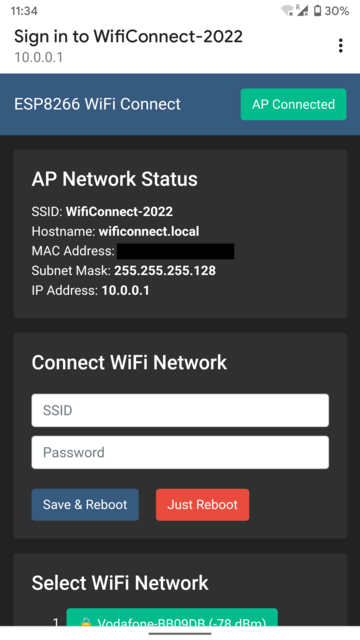
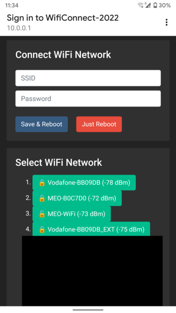

# WiFi Connect ESP-8266

ESP8266 WiFi Connect with Web Captive Portal

### Hardware used

* ESP-01S (ESP-8266)

### Features

* AP Network Status
* WiFi in AP mode (Hotspot mode)
* Web Interface 100% Offline
* WebServer to handle HTTP Requests from clients

### Screenshots
 
 

